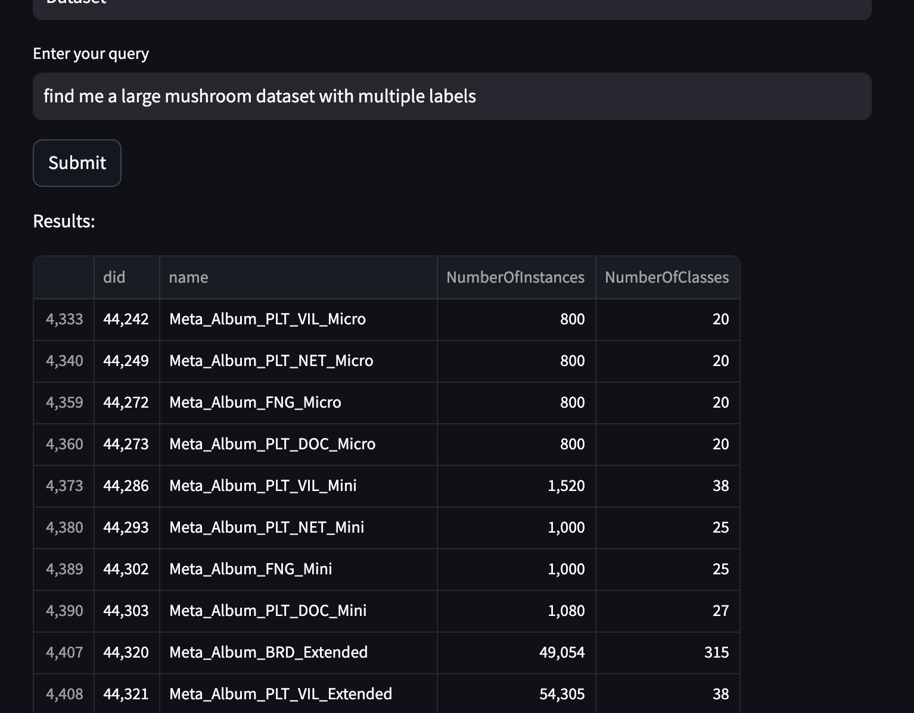

# Frontend Overview
- This page is only an overview. Please refer to the api reference for more detailed information.
- Currently the frontend is based on Streamlit. The hope is to integrate it with the OpenML website in the future.
- This is what it looks like at the moment : 
- This component runs the Streamlit frontend. It is the UI that you see when you navigate to `http://localhost:8501`.
- You can start it by running `cd frontend && streamlit run ui.py &`

## Design Methodology
- The main point to note here is that the UI is responsible for all the post-processing of the results, including the displayed metadata information etc. 
- The RAG pipeline **only** returns IDs of the relevant datasets and then it is upto the frontend to decide what to do with it. This was a conscious choice as the final objective was to let elasticsearch handle the results.
  - This includes the logic for filtering the metadata, applying the filters obtained from the query parsing LLM and also what to do with the output of the RAG pipeline.

## Main logic
- Streamlit is used for displaying the results. A selectbox is used for the user to select what kind of data they want and then a text_input box is used for them to enter their query.
- To make it easier to see what is happening, a spinning indicator with text (eg; Waiting for LLM results) was also added.
- Once the query is entered, the RAG pipeline is sent the query as a get request. 
- Once the results of the RAG pipeline are obtained, the resulting list of IDs is queried from the metadata files (to be replaced with elasticsearch later) and then the relevant data is displayed.
- Now it is possible for the query parsing LLM to read the query and infer the columns that the user finds relevant. (eg: "find me a dataset with multiple classes" would enable the filters where `num_classes >=2`).

### ui.py
- This is where all the above logic is executed and displayed using Streamlit.
### ui_utils.py
- This is where all the logic is defined.
- Query filtering
    - During the processing of the RAG pipeline data ingestion pipeline, the metadata for all the datasets are saved as a csv file `Path(config["data_dir"]) / "all_dataset_description.csv"`. This file contains information like number of classes, number of instances, authors etc. 
    - Using this file, it is possible to "filter" out what is needed and decide which columns to show.
    - The `ResponseParser` and `LLMResponseParser` classes are probably what you are looking for if you want to modify the behavior of how the filters are created and used.
- RAG pipeline
  - The RAG pipeline is used to get the relevant IDs for the query.
- Feedback
  - For now feedback is collected in a feedback.json file. This can be changed to something more meaningful later on.