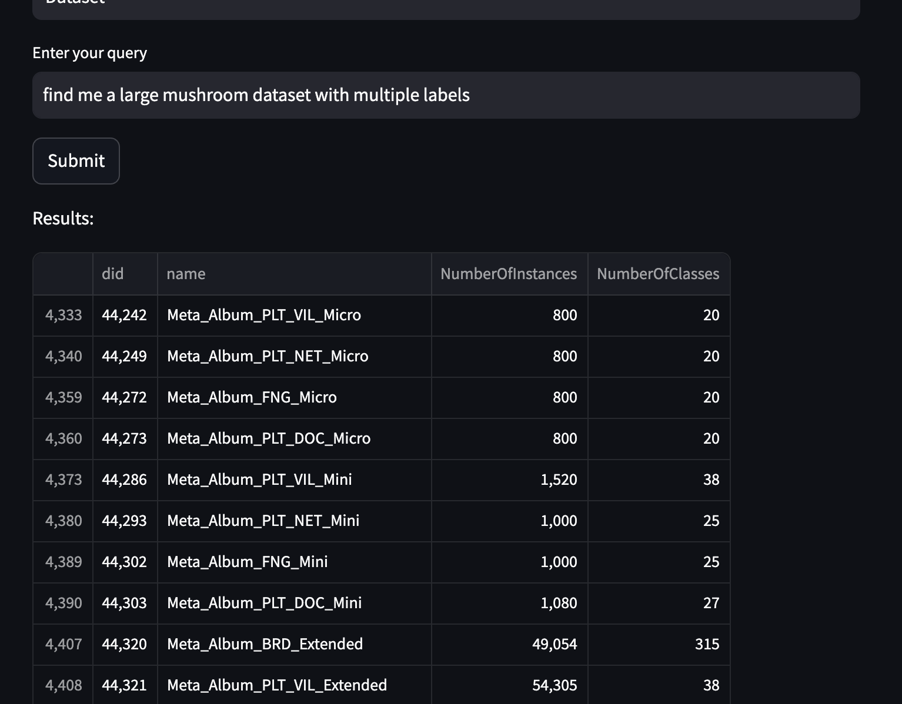

# RAG Pipeline for OpenML

- This repository contains the code for the RAG pipeline for OpenML. 
- [Documentation page](https://openml-labs.github.io/ai_search/)

## Getting started
- Clone the repository
- Create a virtual environment and activate it (```python -m venv venv &&source venv/bin/activate```)
- Run `poetry install` to install the packages 
- If you are a dev and have a data/ folder with you, skip this step.
  - Run training.py (for the first time/to update the model). This takes care of basically everything.
- Install Ollama (https://ollama.com/) and download the models `ollama pull llama3`
- Run `./start_local.sh` to start all the services, and navigate to `http://localhost:8501` to access the Streamlit frontend.
  - WAIT for a few minutes for the services to start. The terminal should show "sending first query to avoid cold start". Things will only work after this message.
  - Do not open the uvicorn server directly, as it will not work.
  - To stop the services, run `./stop_local.sh` from a different terminal.
- Enjoy :)

## CLI access to the API
- We all are lazy sometimes and don't want to use the interface sometimes. Or just want to test out different parts of the API without any hassle. To that end, you can either test out the individual components like so: 
- Note that the `%20` are spaces in the URL. 

### Ollama
- This is the server that runs an Ollama server (This is basically an optimized version of a local LLM. It does not do anything of itself but runs as a background service so you can use the LLM). 
- You can start it by running `cd ollama && ./get_ollama.sh &`

### LLM Service
- This component is the one that runs the query processing using LLMs module. It uses the Ollama server, runs queries and processes them. 
- You can start it by running `cd llm_service && uvicorn llm_service:app --host 0.0.0.0 --port 8081 &`
- Curl Example : `curl http://0.0.0.0:8081/llmquery/find%20me%20a%20mushroom%20dataset%20with%20less%20than%203000%20classes`

### Backend
- This component runs the RAG pipeline. It returns a JSON with dataset ids of the OpenML datasets that match the query.
- You can start it by running `cd backend && uvicorn backend:app --host 0.0.0.0 --port 8000 &`
- Curl Example : `curl http://0.0.0.0:8000/dataset/find%20me%20a%20mushroom%20dataset`

### Frontend
- This component runs the Streamlit frontend. It is the UI that you see when you navigate to `http://localhost:8501`.
- You can start it by running `cd frontend && streamlit run ui.py &`

## Features
### RAG
- Multi-threaded downloading of OpenML datasets
- Combining all information about a dataset to enable searching
- Chunking of the data to prevent OOM errors 
- Hashed entries by document content to prevent duplicate entries to the database
- RAG pipeline for OpenML datasets/flows
- Specify config["training"] = True/False to switch between training and inference mode
- Option to modify the prompt before querying the database (Example: HTML string replacements)
- Results are returned in either JSON
- Easily customizable pipeline
- Easily run multiple queries and aggregate the results
- LLM based query processing to enable "smart" filters
- Streamlit frontend for now

### Enhancements
- One config file to rule them all
- GUI search interface using FastAPI with extra search bar for the results
- Option for Long Context Reordering of results (https://arxiv.org/abs//2307.03172)
- Option for FlashRank Reranking of results
- Caching queries in a database for faster retrieval
- Auto detect and use GPU/MPS if available for training
- Auto retry failed queries for a set number of times (2)


## Example usage
- Note that in this picture, I am using a very very tiny model for demonstration purposes. The actual results would be a lot better :)
- 

## Where do I go from here?
### I am a developer and I want to contribute to the project
- Hello! We are glad you are here. To get started, refer to the tutorials in the [developer tutorial](./developer%20tutorials/index.md) section.
- If you have any questions, feel free to ask or post an issue.


### I just want to use the pipeline
- You can use the pipeline by running the Streamlit frontend. Refer to the getting started section above for more details.
